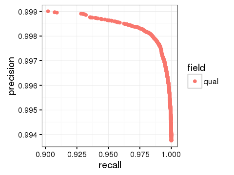

# Germline Empirical Variant Score (EVS) Model Training

[User Guide Home](README.md)

## Table of Contents

[//]: # (BEGIN automated TOC section, any edits will be overwritten on next source refresh)

* [Introduction](#introduction)
* [Requirements](#requirements)
* [Step 1: Build snv and indel training data sets](#step-1-build-snv-and-indel-training-data-sets)
  * [Step 1a: Preliminary filtering of the VCF file](#step-1a-preliminary-filtering-of-the-vcf-file)
  * [Step 1b: Assigning truth labels using hap.py](#step-1b-assigning-truth-labels-using-happy)
  * [Step 1c: Convert the annotated variant output into a CSV feature file](#step-1c-convert-the-annotated-variant-output-into-a-csv-feature-file)
  * [Step 1d (optional): Handling multiple training data sets](#step-1d-optional-handling-multiple-training-data-sets)
* [Step 2: Training an EVS model](#step-2-training-an-evs-model)
* [Step 3: Calculate Scores](#step-3-calculate-scores)
* [Step 4: Evaluate Precision / Recall for the model](#step-4-evaluate-precision--recall-for-the-model)
* [Step 5: Calibrate the model](#step-5-calibrate-the-model)
* [Step 6: Export the model for use in Strelka](#step-6-export-the-model-for-use-in-strelka)
* [Additional instructions for training an RNA-Seq variant scoring model](#additional-instructions-for-training-an-rna-seq-variant-scoring-model)

[//]: # (END automated TOC section, any edits will be overwritten on next source refresh)


## Introduction

This document outlines the Empirical Variant Score (EVS) model training process for Strelka germline variants (also used to produce the models for RNA variants). This is
the same method used to train the default SNV and indel EVS re-scoring models which come with Strelka, although the
specific training and truth data sets shown here are just small examples provided for demonstration purposes.

## Requirements

Strelka germline EVS training has additional dependencies which are not included
in the primary build system. All packages required to retrain the EVS model and
run the steps in this guide are provided in the
[training environment Dockerfile](trainingSomaticEmpiricalScore/Dockerfile)
(shared with the somatic EVS training procedure), which can be used to either setup an EVS training docker image or as a guideline to install
dependencies on another system.

## Step 1: Build snv and indel training data sets

For EVS training, the strelka workflow must be configured with the optional
`--reportEVSFeatures` argument. This will add a new VCF INFO field called `EVSF`
to both SNV and indel VCF outputs. All current EVS features used in Strelka's scoring
model in addition to various experimental features will be reported. Note that EVS
features can be reported even when scoring itself is turned off with the `--disableEVS` option
(recommended to avoid using previous EVS output for training a new EVS model).

Given a strelka gVCF genome.vcf.gz and a corresponding platinum genomes truth vcf with a bed file specifying confident regions, the following steps will produce two CSV feature files suitable for EVS training/testing of the snv and indel models.

### Step 1a: Preliminary filtering of the VCF file

First we need to filter out some unwanted gVCF entries. The following script removes:

1. off-target entries (in exome data)
2. entries that have been flagged with any type of conflict

```bash
gzip -dc genome.vcf.gz |\
python ${STRELKA_INSTALL_PATH}/share/scoringModelTraining/germline/bin/filterTrainingVcf.py |\
${STRELKA_INSTALL_PATH}/libexec/bgzip -cf >|\
filtered.vcf.gz
```

### Step 1b: Assigning truth labels using hap.py

Next, the haplotype comparison tool [hap.py](https://github.com/Illumina/hap.py) is used to assign training labels to the strelka output (this guide assumes hap.py v0.3.7 or greater). The truth set will be used to label strelka calls as true positive (TP) or false positive (FP), and
if confident regions are provided to the labeling scheme, then calls in non-confident regions will be labeled as unknown
(UNK). False negatives are disregarded in the subsequent training steps. In the example below the
[Platinum Genomes](http://www.illumina.com/platinumgenomes/)
truth set is used to label the variant calling output. For NA12878/hg19 these truth data could
be obtained from ftp as follows:

```bash
wget ftp://platgene_ro:@ussd-ftp.illumina.com/2016-1.0/hg19/small_variants/NA12878/NA12878.vcf.gz
wget ftp://platgene_ro:@ussd-ftp.illumina.com/2016-1.0/hg19/small_variants/ConfidentRegions.bed.gz
```

Using this truth set, the following is an example hap.py command-line for a 40 core cluster producing appropriately
labeled output:

```bash
hap.py NA12878.vcf.gz filtered.vcf.gz -f ConfidentRegions.bed.gz -o happy_PG_annotated -V --preserve-info --threads 40 -P
```

### Step 1c: Convert the annotated variant output into a CSV feature file

The annotated hap.py output is next converted to a pair of csv files respectively containing features for snv and
indel calls. The example command-line:


```
gzip -dc happy_PG_annotated.vcf.gz |\
python ${STRELKA_INSTALL_PATH}/share/scoringModelTraining/germline/bin/parseAnnotatedTrainingVcf.py \
    --testSet chr2 \
    --testSet chr20 \
    --snvOutput snv_training_data.csv \
    --indelOutput indel_training_data.csv
    --snvTestOutput snv_test_data.csv \
    --indelTestOutput indel_test_data.csv
```

...generates the labeled snv and indel feature files `snv_training_data.csv` and `indel_training_data.csv` for use in subsequent training steps along with `snv_test_data.csv` and `indel_test_data.csv` for use in testing/evaluation steps, with the test data containing all variants from chromosomes 2 and 20 and the training data containing the remaining variants.

### Step 1d (optional): Handling multiple training data sets

If multiple vcfs are to be combined for training/testing, process each
VCF to a labeled CSV feature file using the procedure described above. These training data may
be combined as required for the model learning and/or evaluation procedures described below.


## Step 2: Training an EVS model

The next step is to train a model given one or more labeled feature datasets produced in Step 1.
An example is shown below; the `--features` argument below can be selected from germline.snv, germline.indel, rna.snv and rna.indel for snv or indel features in germline or rna models.

```
python ${STRELKA_INSTALL_PATH}/share/scoringModelTraining/germline/bin/evs_learn.py \
    --features germline.snv \
    --model germline.rf \
    --output snv_model.pickle \
    --ambig \
    snv_training_data.csv
```
The `--ambig` flag causes unknown variants to be added to the training data and treated as false positives, with weighting such that the total weight of unknown variants is half the total weight of false positives. Use of this flag is recommended for SNVs (where a large number of unknown variants are in problematic genomic regions and likely to be false) but not for indels.

## Step 3: Calculate Scores

Given a trained model any labeled testing data can be scored. The testing data is provided in the same format as
csv training files used in step 2.

```
python ${STRELKA_INSTALL_PATH}/share/scoringModelTraining/germline/bin/evs_evaluate.py \
    --features germline.snv \
    --classifier snv_model.pickle \
    --output snv_classified.csv \
    snv_test_data.csv
```

=>

```
Reading snv_test_data.csv
ptag      FP       TP
tag
FP      7524     4652
TP     17635  1920627
UNK   121596    54937
```

## Step 4: Evaluate Precision / Recall for the model

Any scored test data output from step 3 can be further processed to evaluate precision / recall as
follows:

```
python ${STRELKA_INSTALL_PATH}/share/scoringModelTraining/germline/bin/evs_pr.py \
     -N 100 \
     --output snv_precisionrecall.csv \
     snv_classified.csv
```

=>

```
Reading snv_classified.csv
Processed 10 / 100 qual values for qual
...
Processed 100 / 100 qual values for qual
```

We can look at the result e.g. using R:

```R
data = read.csv('snv_precisionrecall.csv')
head(data)
```

=>

```
  X field      qual      tp   fp     fn tp_filtered fp_filtered     na
1 0  qual 0.3460096 1928415 6076   9847        9847        6100  68868
2 1  qual 0.1508784 1935279 8362   2983        2983        3814  98211
3 2  qual 0.1150540 1936334 9213   1928        1928        2963 107510
4 3  qual 0.7410711 1898631 3456  39631       39631        8720  37226
5 4  qual 0.9300044 1806764 2069 131498      131498       10107  16868
6 5  qual 0.8391139 1870848 2878  67414       67414        9298  27255
  na_filtered precision    recall      fracNA
1      107665 0.9968591 0.9949197 0.034376265
2       78322 0.9956978 0.9984610 0.048098981
3       69023 0.9952646 0.9990053 0.052365814
4      139307 0.9981830 0.9795533 0.019195457
5      159665 0.9988562 0.9321567 0.009239191
6      149278 0.9984640 0.9652194 0.014337334
```

... or make a plot like this:

```R
library(ggplot2)
ggplot(data, aes(x=recall, y=precision, color=field)) +
    geom_point() + theme_bw()
ggsave("snv.png", width=4, height=3, dpi=120)
```



## Step 5: Calibrate the model

The scored test data can also be used to generate a QQ plot and calibrate the model, so that reported EVS scores (GQX values) will correspond roughly with phred-scale precision:

```
python ${STRELKA_INSTALL_PATH}/share/scoringModelTraining/germline/bin/evs_qq.py \
    --output snv_qq.csv \
    --calibration snv_calibration.json \
    snv_classified.csv
```

This produces a CSV output file that can be used to plot binned empirical precision vs uncalibrated or calibrated EVS scores, as well as a JSON calibration file that can be used to apply the inferred calibration when exporting the model (Step 6).

## Step 6: Export the model for use in Strelka

Strelka uses models in JSON format, which can be produced from the model pickle file and (optionally) the calibration file as follows:

```
python ${STRELKA_INSTALL_PATH}/share/scoringModelTraining/germline/bin/evs_exportmodel.py \
    --classifier snv_model.pickle \
    --output germlineSNVScoringModel.json \
    --calibration snv_calibration.json \
    --varianttype SNV \
    --threshold 3
```

Note that the EVS score threshold for the variant type in question can also specified.

To use in Strelka, point it to the new model files by adding
```
--snvScoringModelFile germlineSNVScoringModel.json \
--indelScoringModelFile germlineIndelScoringModel.json
```
to the options supplied to configureStrelkaGermlineWorkflow.py.

Note that if the model's feature set has been changed, additional steps are required to use this file in Strelka. This operation is outside of user guide scope at present.

## Additional instructions for training an RNA-Seq variant scoring model

For RNA-Seq models, the following additional options are recommended for parseAnnotatedTrainingVcf (Step 1c):

`--suppressGTMismatch` labels candidate variants as correct if the allele agrees with the truth set but the genotype does not (by default, genotype mismatch causes variants to be labeled as incorrect).

`--discardFNs` omits false negative variants from the training and test sets. This means that reported recall will be relative to the set of candidate variants rather than reflective of Strelka's overall recall.

`--removeRNAEditing` labels variants that potentially arose via RNA editing (A->G and T->C changes) as having unknown truth status (the truth set is based on DNA, so will be incorrect where RNA editing occurs).

Current practice for RNA-seq model training (Step 2) is to use the `--balance` option (downsamples the positive or negative training samples so as to use an equal number of both).

For evaluating precision and recall (Step 4), the `--stratifyByCoverage` option is useful to output results for low-coverage (AD1<3) and high-coverage (AD1>=3) variants, as the majority of candidate RNA SNVs have low coverage.

Finally, evs_exportmodel (Step 6) must be run with `--calltype RNAseq`.

