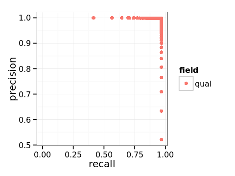

# Somatic Empirical Variant Score (EVS) Model Training

[User Guide Home](README.md)

## Table of Contents

[//]: # (BEGIN automated TOC section, any edits will be overwritten on next source refresh)

* [Introduction](#introduction)
* [Requirements](#requirements)
* [Step 1: Build a training data set](#step-1-build-a-training-data-set)
  * [Step 1a: Process a single VCF into a labeled feature CSV file](#step-1a-process-a-single-vcf-into-a-labeled-feature-csv-file)
  * [Step 1b: Handle multiple training data sets](#step-1b-handle-multiple-training-data-sets)
* [Step 2: Training an EVS model](#step-2-training-an-evs-model)
* [Step 3: Calculate Scores](#step-3-calculate-scores)
* [Step 4: Evaluate Precision / Recall for the model](#step-4-evaluate-precision--recall-for-the-model)
* [Step 5: Export the model for use in Strelka](#step-5-export-the-model-for-use-in-strelka)

[//]: # (END automated TOC section, any edits will be overwritten on next source refresh)


## Introduction

This document outlines the process of training a somatic Empirical Variant Score (EVS) model for Strelka.

## Requirements

Strelka somatic EVS training has additional dependencies which are not included
in the primary build system. All packages required to retrain the EVS model and
run the steps in this guide are provided in the [training environment
Dockerfile](trainingSomaticEmpiricalScore/Dockerfile), which can be used to
either setup an EVS training docker image or as a guideline to install
all dependencies on another system.

## Step 1: Build a training data set

For EVS training, the strelka workflow must be configured with the optional
`--reportEVSFeatures` argument. This will add a new VCF INFO field called `EVSF`
to both SNV and indel VCF outputs. All current EVS features used in Strelka's scoring
model in addition to various experimental features will be reported. Note that EVS
features can be reported even when scoring itself is turned off with the `--disableEVS` option.

### Step 1a: Process a single VCF into a labeled feature CSV file

Given a strelka somatic VCF with optional EVSF output and a truth list, training and test CSV files with features and
TP/FP/FN labeling can be produced as follows:

```
python ${STRELKA_INSTALL_PATH}/share/scoringModelTraining/somatic/bin/vcf_to_feature_csv.py \
    --truth ${STRELKA_INSTALL_PATH}/share/demo/strelka/data/PG_admix_truth_snvs_chr21_1-25000000.vcf.gz \
    --features strelka.snv \
    --output admix_training_data.csv \
    --testSet chr2 \
    --testSet chr20 \
    --testOutput admix_test_data.csv \
    ${STRELKA_INSTALL_PATH}/share/demo/strelka/data/strelka_admix_snvs_chr21_1-25000000.vcf.gz
```

This example shows how chromosomes 2 and 20 can be separated out as test data. If no `--testSet` argument is specified, the entire genome will be used for training. If no truth list is supplied, all variants will be treated as false positives (this is useful for normal-normal analyses). The script also supports additional bed file inputs to define FP and ambiguous regions &mdash; see script usage for details.

### Step 1b: Handle multiple training data sets

Typically multiple strelka analyses should available for training/testing, in this case process each
VCF to a labeled CSV feature file using the procedure described in Step 1a. These training data may
be combined as required for the model learning and/or evaluation procedures described below.


## Step 2: Training an EVS model

The next step is to train a model given one or more labeled feature datasets produced in Step 1.
An example is shown below, note the `--features` argument below must match that used to generate
the input training dataset(s), or else list a set of features present in all input dataset(s).

```
python ${STRELKA_INSTALL_PATH}/share/scoringModelTraining/somatic/bin/evs_learn.py \
    --features strelka.snv \
    --model strelka.rf \
    --plots \
    --output admix_training_model.pickle \
    admix_training_data.csv
```

## Step 3: Calculate Scores

Given a trained model any labeled testing data can be scored.

```
python ${STRELKA_INSTALL_PATH}/share/scoringModelTraining/somatic/bin/evs_evaluate.py \
    --features strelka.snv \
    --classifier admix_training_model.pickle \
    --output admix_classified.csv \
    admix_test_data.csv
```

=>

```
Reading admix_test_data.csv
ptag   FN     FP    TP
tag
FN    178      0     0
FP      0  17640     1
TP      0      0  5439

[3 rows x 3 columns]
```

## Step 4: Evaluate Precision / Recall for the model

Any scored test data output can be further processed to evaluate precision / recall as
follows:

```
python ${STRELKA_INSTALL_PATH}/share/scoringModelTraining/somatic/bin/evs_pr.py \
     --output admix_precisionrecall.csv \
     admix_classified.csv
```

=>

```
Reading admix_classified.csv
Processed 10 / 99 qual values for qual
Processed 20 / 99 qual values for qual
Processed 30 / 99 qual values for qual
Processed 40 / 99 qual values for qual
Processed 50 / 99 qual values for qual
Processed 60 / 99 qual values for qual
Processed 70 / 99 qual values for qual
Processed 80 / 99 qual values for qual
Processed 90 / 99 qual values for qual
```

We can look at the result e.g. using R:

```R
data = read.csv('admix_precisionrecall.csv')
head(data)
```

=>

```
  X field qual   tp   fp  fn tp_filtered fp_filtered precision    recall
1 0  qual 0.00 5439 5531 178           0       12110 0.4958067 0.9683105
2 1  qual 0.01 5439 3508 178           0       14133 0.6079133 0.9683105
3 2  qual 0.02 5439 2564 178           0       15077 0.6796201 0.9683105
4 3  qual 0.03 5439 1961 178           0       15680 0.7350000 0.9683105
5 4  qual 0.04 5439 1521 178           0       16120 0.7814655 0.9683105
6 5  qual 0.05 5439 1200 178           0       16441 0.8192499 0.9683105
```

... or make a plot like this:

```R
library(ggplot2)
ggplot(data, aes(x=recall, y=precision, color=field)) +
    geom_point() + theme_bw()
ggsave("admix.png", width=4, height=3, dpi=120)
```



The ROC curve plotted in this example shows the expected result of both a small training set
and testing with the training data.

## Step 5: Export the model for use in Strelka

Strelka uses models in JSON format, which can be produced from the model pickle file as follows:

```
python ${STRELKA_INSTALL_PATH}/share/scoringModelTraining/somatic/bin/evs_exportmodel.py \
    --classifier admix_training_model.pickle \
    --output admix_training_model.json
```

Note that if the model's feature set has been changed, additional steps are required to use this file in Strelka.
This operation is outside of user guide scope at present.
